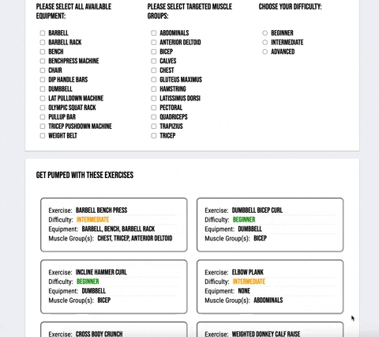
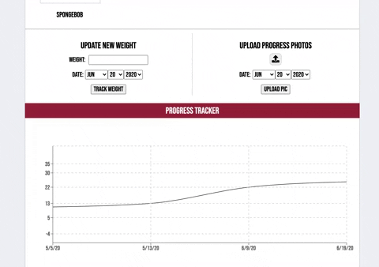
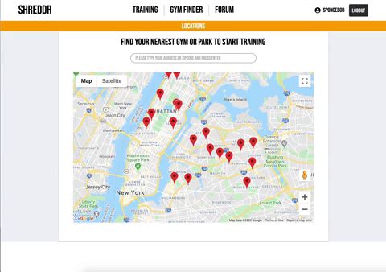

# Shreddr

### Shreddr
Shreddr is a web application that recommends workouts based on the equipment you have.

Click [here](https://boiling-plateau-33508.herokuapp.com/#/) to launch Shreddr!

[](https://boiling-plateau-33508.herokuapp.com/#/)

## Background and Overview 
Because of COVID-19 related quarantines throughout the world, gyms are closed and people have had to rely on workouts at home to stay fit. Shreddr’s goal is to provide workout options to people with limited exercise equipment. It will maintain a database of exercises that users can use to generate workouts based on their fitness goals and the equipment that they have available. Users will also be able to keep track of their progress, such as bodyweight and lifts.

## Functionality and MVP List

**1. User Authentication**
- [ ] Users can create an account to upload progress photos and post in the forum.


**2. Profiles**
- [ ] Logged in users can edit their profile, track workouts, and upload progress photos.
- [ ] Logged in users can edit their profile privacy.

**3. Workout Generator**
- [ ] Users can filter workouts by available equipment.
- [ ] Users can access fitness and workout tips. 



**4. Progress Tracker**
- [ ] Logged in users can track their body weight.
- [ ] Logged in users can visualize their progress in graphs. 



**5. Outdoor Gym/ Park Finder**
- [ ] Users can search for the nearest gyms and parks. 



**Bonus**
- [ ] Forum

## Technologies and Technical Challenges

**Workout Generator**
* We will maintain a database containing data about exercises, such as equipment needed, muscle groups targeted, and difficulty level.  Users can specify the equipment that they have access to as well as their skill level, and Shreddr will recommend a balanced workout routine according to their individual fitness goals.

**Recharts**
* Logged in users can update and track their bodyweight. 

**Amazon Web Services**
* Users can upload private or public progress pictures and attach them to their profile.

**Google Maps API**
* Users can search for nearby outdoor gyms and parks, and workouts can be generated based on the equipment available there.

## Code Snippets
It is not possible to perform certain exercises without all required equipment. A user should only be presented with exercises of which the user has all of the required equipment to perform each exercise. For example, a user checks `dumbbell` under equipment and `gluteus maximus` under muscle groups. The Workout Generator should not include `back squat` as the user did not check `barbell`. However, the generator will include every exercise that targets out at least one of the muscle groups selected by the user. 

```javascript
let filteredDifficulty = [], 
    filteredEquipment = [], 
    filteredMuscleGroups = [], 
    equipValues = [], 
    muscleValues = [];

if (this.state.exercises.length > 0) {

    // if no difficulty selected, the user will see exercises of all difficulties
    if (this.state.difficulty !== '' ) {
        this.props.exercises.forEach(ele => {
        if (this.state.difficulty === 'beginner') {
            if (ele.difficulty === this.state.difficulty) {
                filteredDifficulty.push(ele);
            }
        } else if (this.state.difficulty === 'intermediate') {
            if (ele.difficulty === 'beginner' || ele.difficulty === 'intermediate') {
                filteredDifficulty.push(ele);
            }
        } else {
            filteredDifficulty.push(ele);
            }
        })
    } else {
        filteredDifficulty = this.state.exercises;
    }

    // if no equipment selected, the user will see all exercises with any equipment
    equipValues = Object.values(this.state.equipment);
    if (equipValues.every(val => val === false)) {
        filteredEquipment = filteredDifficulty;
    } else {

        // if equipment selected, the user will see workouts of which all equipment have been selected 
        filteredDifficulty.forEach(e => {
            if (e.equipment.every(equip => this.state.equipment[equip.split(' ').map(e => e.charAt(0).toUpperCase() + e.slice(1)).join(' ')] === true)) {
                filteredEquipment.push(e);
            }
        });
    }

    // if no muscle group selected, the user will see exercises for all muscle groups
    muscleValues = Object.values(this.state.muscleGroups);
    if (muscleValues.every(val => val === false)) {
        filteredMuscleGroups = filteredEquipment;
    } else {

        // if muscle groups selected, the user will see workouts that contain at least one of the muscle groups selected
        filteredEquipment.forEach(e => {
            if (e.muscleGroups.some(muscle => this.state.muscleGroups[muscle.split(' ').map(m => m.charAt(0).toUpperCase() + m.slice(1)).join(' ')] === true)) {
                filteredMuscleGroups.push(e);
            }
        });
    }
}

```


## Group Members and Work Breakdown

* Jae-Son Song - team lead
* Tiffany Chin - front end
* Eric Lee - back end
* Jesse Lin - flex

### Day 1
* Back end auth - Eric, Jae-Son
* Front end auth - Tiffany, Jesse
* Workout database - Eric, Jae-Son

### Day 2
* Back end user profiles - Eric, Jae-Son
* AWS - Eric, Jae-Son
* Splash page, front end user profiles - Tiffany, Jesse

### Day 3
* Workout generator back end - Eric, Jae-Son
    * Logic for filtering workouts
* Workout generator front end - Tiffany, Jesse

### Day 4
* Gym finder backend - Eric, Jae-Son
* Gym finder frontend - Tiffany, Jesse
* Production README
* Finish testing and debugging

